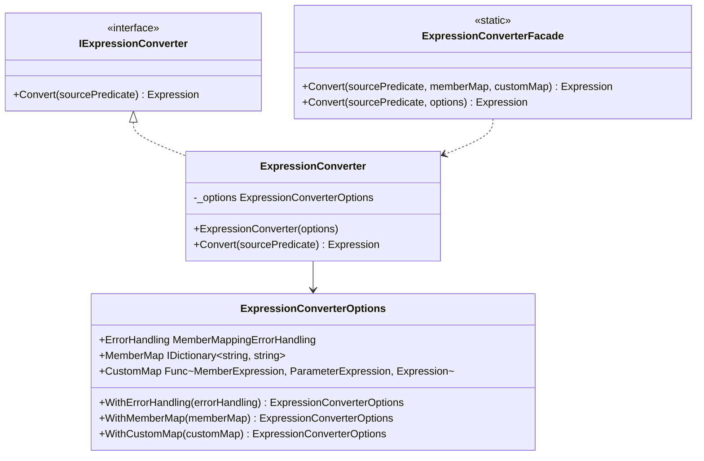

# Architecture, Dependency Injection & Performance Caching

This document covers the architectural layout of the library, registering it within your Dependency Injection (DI) container, and performance characteristics including the internal cache.

---

## 🏛️ Library Architecture

`CrossTypeExpressionConverter` is designed to support both quick, one-off conversions via a static facade, and enterprise-grade architectural patterns using instance-based converters injected via constructor injection.



- **`IExpressionConverter`**: Defines the abstraction for conversion. Decouples your application services from the concrete converter implementation, facilitating unit testing.
- **`ExpressionConverter`**: The concrete thread-safe implementation of `IExpressionConverter`. It takes an `ExpressionConverterOptions` instance at construction and compiles expressions accordingly.
- **`ExpressionConverterFacade`**: A static class providing backward compatibility for projects migrating from older versions. Internally, it instantiates an `ExpressionConverter` on-demand.

---

## ⚙️ Configurable Options (`ExpressionConverterOptions`)

`ExpressionConverterOptions` manages configuration. It follows a fluent builder pattern to encourage immutability. Each `.With...()` method returns a **new instance** of the options class, ensuring thread safety during configuration:

```csharp
var options = ExpressionConverterOptions.Default
    .WithErrorHandling(MemberMappingErrorHandling.ReturnDefault)
    .WithMemberMap(myMap);
```

---

## 💉 Dependency Injection (DI) Registration

In modern .NET applications, you should register `IExpressionConverter` in your IoC container. Since the converter is thread-safe, it can be registered as a **Singleton**.

### Example Registration in ASP.NET Core (`Program.cs`)
```csharp
using Microsoft.Extensions.DependencyInjection;
using CrossTypeExpressionConverter;

var builder = WebApplication.CreateBuilder(args);

// 1. Build your mapping options
var converterOptions = new ExpressionConverterOptions()
    .WithErrorHandling(MemberMappingErrorHandling.Throw)
    .WithMemberMap(MappingUtils.BuildMemberMap<User, UserEntity>(u => new UserEntity
    {
        UserId = u.Id,
        UserName = u.Name,
        Enabled = u.IsActive,
        DateOfBirth = u.BirthDate
    }));

// 2. Register the converter as a Singleton
builder.Services.AddSingleton<IExpressionConverter>(new ExpressionConverter(converterOptions));

var app = builder.Build();
```

### Injecting and Using the Converter
Inject the interface into your controllers, services, or repositories:

```csharp
public class UserService
{
    private readonly IUserRepository _repository;
    private readonly IExpressionConverter _expressionConverter;

    public UserService(IUserRepository repository, IExpressionConverter expressionConverter)
    {
        _repository = repository;
        _expressionConverter = expressionConverter;
    }

    public async Task<List<UserDto>> GetUsersAsync(Expression<Func<User, bool>> domainPredicate)
    {
        // Translate the domain-layer filter into an database-entity-layer filter
        Expression<Func<UserEntity, bool>> dbPredicate = 
            _expressionConverter.Convert<User, UserEntity>(domainPredicate);

        var entities = await _repository.FindAsync(dbPredicate);
        return entities.Select(e => MapToDto(e)).ToList();
    }
}
```

---

## ⚡ Performance Caching (`MemberMappingCache`)

Reflection is required to inspect properties and read the `[MapsTo]` attribute. Doing this repeatedly for every conversion request introduces significant overhead. 

To solve this, the library utilizes an internal, thread-safe cache: `MemberMappingCache`.

### Internal Configuration
The cache is powered by `Microsoft.Extensions.Caching.Memory.MemoryCache` with policies designed to prevent unbounded memory growth:
- **Size Limit (`SizeLimit = 1000`)**: Restricts the cache to 1,000 mapping entries.
- **Compaction (`CompactionPercentage = 0.2`)**: When the cache is full, it automatically evicts the 200 least-recently-used (LRU) entries.
- **Expiration (`SlidingExpiration = 30 minutes`)**: If a cached property mapping is not accessed for 30 minutes, it is removed to free memory.

### 🚀 Performance Characteristics: Cache Priming
Internally, the library automatically primes the cache the first time a given type's members are resolved during conversion. The `MemberMappingCache.PrimeCacheForType()` method exists as an `internal` optimization — it is **not** exposed to consumers of the NuGet package.

In practice, this means:
- The **first conversion** involving a new source type incurs a one-time reflection cost to scan and cache all `[MapsTo]` attributes on that type's members.
- All **subsequent conversions** involving the same type will be served from the cache with near-zero overhead.
- The cache is static and shared across all `ExpressionConverter` instances, so even if you create multiple converters, attribute lookups are deduplicated.

> **Note:** For most applications, the initial cache population is imperceptible (sub-millisecond). It is only relevant in extremely latency-sensitive scenarios like high-frequency trading systems.

---

<p align="center">
  <a href="README.md">📚 Documentation Index</a>
</p>
