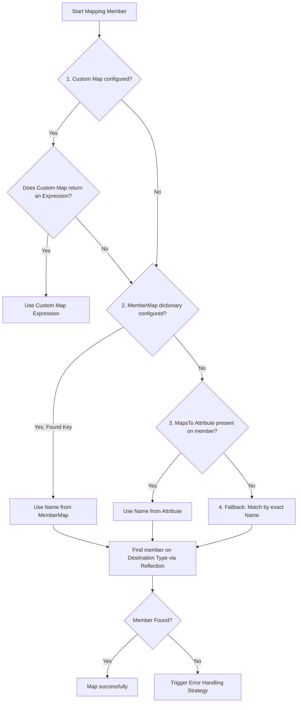

# Mapping Strategies & Precedence

`CrossTypeExpressionConverter` supports multiple layers of property mapping configuration. This guide explains each mapping strategy in detail, provides example implementations, and shows how they interact.

---

## 🔝 Precedence Order

When the expression converter visits a property or field in a LINQ expression tree, it resolves the destination member name using the following order of precedence:



1. **Custom Mapping Delegate (`CustomMap`)**: Resolves the expression using custom delegate logic. If it returns a non-null expression, that expression is used directly.
2. **Explicit Dictionary Mapping (`MemberMap`)**: Resolves property names using a configured `IDictionary<string, string>`.
3. **Attribute-Based Mapping (`[MapsTo]`)**: Looks for the `[MapsTo]` attribute on the source type's properties.
4. **By-Name Matching**: Matches properties on the destination type with the same name as the source type.

---

## 1. Custom Mapping Delegate (`CustomMap`)
The `CustomMap` property accepts a delegate with the signature:
```csharp
Func<MemberExpression, ParameterExpression, Expression?> CustomMap
```
This delegate receives the `MemberExpression` representing the source property being accessed and the `ParameterExpression` representing the destination parameter. 

If this delegate returns a non-null `Expression`, the converter replaces the source member access with the returned expression in the generated tree. If it returns `null`, the converter falls back to the next mapping strategy.

### Example: Custom Expression / Flat Path Mapping
Imagine you want to map `Source.NestedObject.Code` to a direct string property `Destination.NestedCode` (path flattening), or apply a type transformation.

```csharp
using System;
using System.Linq.Expressions;
using System.Reflection;
using CrossTypeExpressionConverter;

public class OrderSource { public OrderDetails Details { get; set; } }
public class OrderDetails { public string OrderCode { get; set; } }

public class OrderDestination { public string FlatCode { get; set; } }

// Converter Usage
Expression<Func<OrderSource, bool>> sourceFilter = s => s.Details.OrderCode == "TX-100";

Func<MemberExpression, ParameterExpression, Expression?> myCustomMap = (srcMember, destParam) =>
{
    // Detect access to s.Details.OrderCode
    if (srcMember.Member.Name == nameof(OrderDetails.OrderCode) &&
        srcMember.Expression is MemberExpression innerExpr &&
        innerExpr.Member.Name == nameof(OrderSource.Details))
    {
        // Replace s.Details.OrderCode with destParam.FlatCode
        PropertyInfo destProp = typeof(OrderDestination).GetProperty(nameof(OrderDestination.FlatCode));
        return Expression.Property(destParam, destProp);
    }
    return null; // Fall back to default mapping for other properties
};

var options = new ExpressionConverterOptions().WithCustomMap(myCustomMap);
var converted = ExpressionConverterFacade.Convert<OrderSource, OrderDestination>(sourceFilter, options);
// Output predicate is equivalent to: d => d.FlatCode == "TX-100"
```

---

## 2. Explicit Dictionary Mapping (`MemberMap`)
A `MemberMap` is an `IDictionary<string, string>` where keys represent source property names and values represent destination property names.

### Method A: MappingUtils Helper (Recommended)
`MappingUtils.BuildMemberMap` provides a compiler-checked, refactoring-friendly way to generate the mapping dictionary using an object initializer expression.

```csharp
var map = MappingUtils.BuildMemberMap<User, UserEntity>(user => new UserEntity
{
    UserId = user.Id,
    UserName = user.Name,
    Enabled = user.IsActive
});
```

**Constraints of `BuildMemberMap`:**
- The expression body must be an object initializer (`new TDestination { ... }`).
- The right-hand side of each property assignment must be a direct property access on the input parameter (e.g. `user.Id`), not nested access (like `user.Address.City`) or method calls.
- Assignments violating these rules are ignored by `BuildMemberMap` (relying on default property name matching for those properties).

### Method B: Manual Dictionary
You can also construct the dictionary manually:
```csharp
var map = new Dictionary<string, string>
{
    { "Id", "UserId" },
    { "Name", "UserName" },
    { "IsActive", "Enabled" }
};
```

---

## 3. Attribute-Based Mapping (`[MapsTo]`)
You can decorate properties on your source model with the `[MapsTo]` attribute to declare their destination property names directly. This avoids writing explicit mapping code.

### Example
```csharp
using CrossTypeExpressionConverter;

public class CustomerSource
{
    [MapsTo(nameof(CustomerEntity.DatabaseId))]
    public int Id { get; set; }

    [MapsTo(nameof(CustomerEntity.CompanyName))]
    public string Name { get; set; }
}

public class CustomerEntity
{
    public int DatabaseId { get; set; }
    public string CompanyName { get; set; }
}
```

When you convert an expression involving `CustomerSource`, the converter automatically checks for these attributes:

```csharp
Expression<Func<CustomerSource, bool>> filter = c => c.Id == 123;
var converted = ExpressionConverterFacade.Convert<CustomerSource, CustomerEntity>(filter);
// Result: c => c.DatabaseId == 123
```

*Note: For details on how attribute metadata is cached to ensure peak performance, see the [Architecture & Dependency Injection](architecture-and-di.md) documentation.*

---

## 4. By-Name Matching (Fallback)
If a member is not intercepted by a `CustomMap`, is not found in the `MemberMap` dictionary, and doesn't carry a `[MapsTo]` attribute, the converter attempts to find a member with the **exact same name** on the destination type.

- **Case Sensitivity**: Reflection queries are run using `BindingFlags.Instance | BindingFlags.Public`. Property matching is **case-sensitive**.
- **Usage**: Properties like `Email`, `CreatedAt`, or `Status` that are identical between your DTO/Domain and Entity layers will be mapped automatically without any configuration.

---

<p align="center">
  <a href="README.md">📚 Documentation Index</a>
</p>
